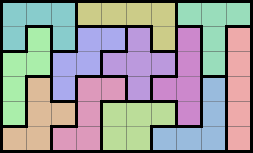

# Hex

Find the pentomino puzzle solutions for a 10x6 board.

## Pieces and Board

There are 12 pentomino pieces.

A solution tiles the board. Here is solution 9356:

## Download

Download the code using git clone:

~~~
mkdir -p ~/code/hex
cd ~/code/hex
git clone https://github.com/flenniken/hex.git .
~~~

## Compile

Build the hex program by running the make command.

~~~
make

cc -O3 -c source/hex.c
cc -O3 -c source/cal.c
cc -O3 -c source/asm.c
cc -o hex hex.o cal.o asm.o
~~~

## Run

Run hex to write the solutions to the solutions.out file. It takes
about 15 seconds to run on my computer.

~~~
./hex

....................................
Total time 14.55 sec
See solution.out
~~~

There are 9356 solutions. The last one found is shown below.  It is
the same solution shown in color above. Each piece is numbered 1 to 12
in hexadecimal: 1, 2, 3, 4, 5, 6, 7, 8, 9, a, b, c.

~~~
tail -7 solution.out

6662222444
6869952741
8899555741
8c9bb57731
8ccbaaa731
ccbbaa3331
~~~

## Non-Trival Solutions

A trival solution is created from a known solution by rotation or
reflection of the whole board.

Run trival.py to find the trival and non-trival solutions by post
processing the solutions.out file. There are 2339 non-trival solutions.
Here is the last one:

~~~
python trival.py | tail -7

aaa6657777
1aa6555722
1bb6658882
13bcc88942
13bbcc9942
1333c99444
~~~

## History

I wrote the C code in late 1980's. Several people at Microrim where I
worked at the time were all working independently on the problem for
fun. It took a long time to run in those days. I added some assembly
to speed it up.  The solution.out file that's checked in has a date of
1991 and shows it ran in 28730.53 seconds which is about 8 hours.

I updated the code two times. The first was so it would run on Windows
and 32 bit hardware. The assembly was a problem so I took it out. The
second time, the last few days, I updated it to run on 64 bit hardware
on a Mac. No big changes. The code is at this point is a historial
artifact.

The latest changes added the python script to verify that the code
finds the correct number of non-trival solutions as wikipedia
reports. This was done post processing because it was a lot easier in
python and I didn't want modify the original C code too much.

https://en.wikipedia.org/wiki/Pentomino

