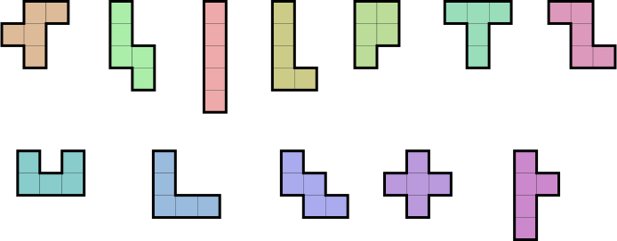

# hex

Find the solutions to a Pentomino puzzle on a 10x6 board.

Here are the pieces:



Run hex to see the solutions.

```
make

cc -O3 -c source/hex.c
cc -O3 -c source/cal.c
cc -O3 -c source/asm.c
cc -o hex hex.o cal.o asm.o

./hex

....................................
Total time 14.55 sec
See solution.out

tail solution.out 

Found solution 9356
elapsed time 14.55 sec
6662222444
6869952741
8899555741
8c9bb57731
8ccbaaa731
ccbbaa3331
```
